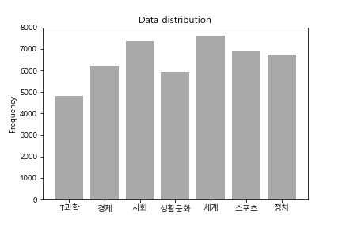
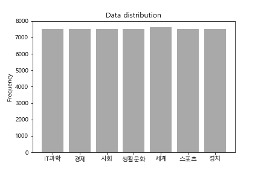
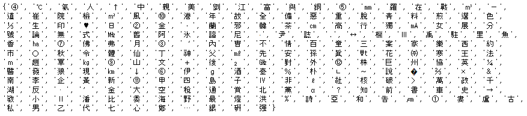
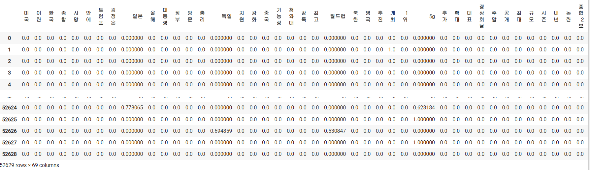
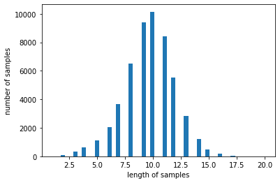
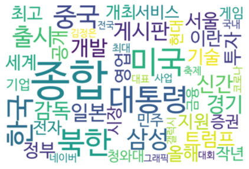

# News Topic Classification
데이콘 주관 뉴스포틱 분류 AI 경진대회 데이터셋을 활용한 프로젝트.  
Dacon 뉴스 토픽 분류 AI 경진대회 : https://dacon.io/competitions/official/235747/overview/description

## 데이터 분석

데이터 분포도를 통해 어느정도 inbalanced data distribution을 갖고있다는 점을 확인

Easy Data Augmentation을 활용해 클래스 분포를 균일하게 설정

## 전처리 적용

- 숫자, 영어, 한글이 아닌 특수문자에 종류 확인
- 대표 나라 이름 및 경제항목은 일치하는 한글로 변환하고 기타 특수문자는 삭제
- PykoSpacing을 사용해 띄어쓰기 교정

검출한 특수문자

## 통계량 분석

TF-IDF
- 1,2gram적용, 빈도수 0.05이하, 0.85이상의 빈도수 단어들 제거

Word2Vec

- 완성된 임베딩 매트릭스의 크기 : (11195, 100)
- "북한" 과 가장 유사한 단어
   [('유엔', 0.9455116987228394), ('김정은', 0.940281093120575), ('정부', 0.9323728084564209), ('도발', 0.9322386384010315), ('외교', 0.9315954446792603), ('핵', 0.9292498826980591), ('총리', 0.9286845326423645), ('인권', 0.9266415238380432), ('회담', 0.9243283867835999), ('안보리', 0.9243077039718628)]

## 데이터 증강
- Easy data augmentation
- 참고 링크: [Easy data augmentation(EDA)](https://github.com/catSirup/KorEDA)

## 데이터 시각화

Wordcloud
- wordcloud를 통해 데이터 시각화 분석
- 참고 링크: [wordcloud github repository](https://github.com/amueller/word_cloud)

